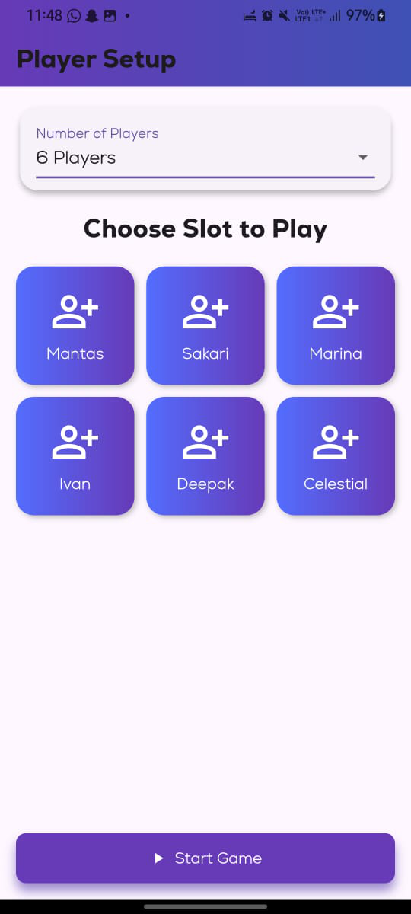
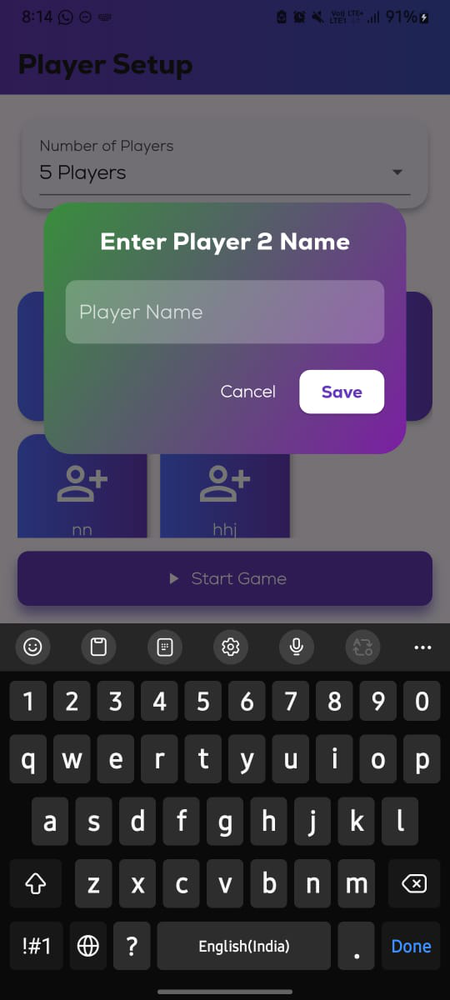
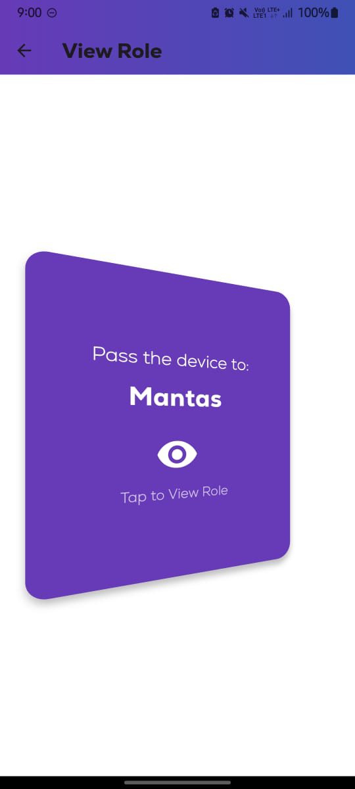
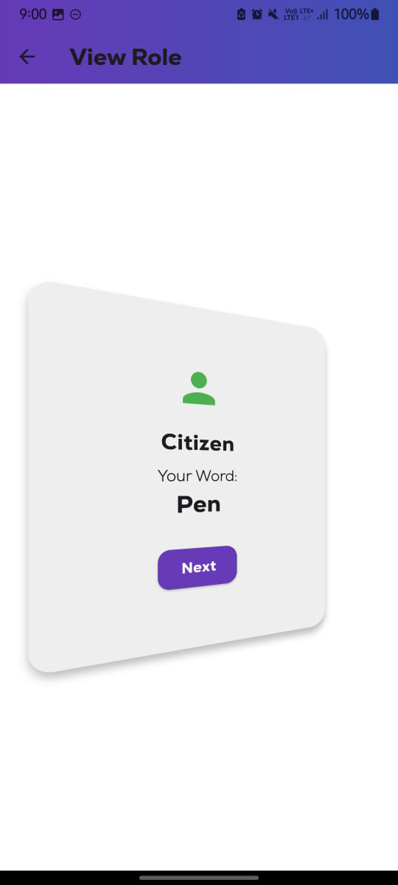
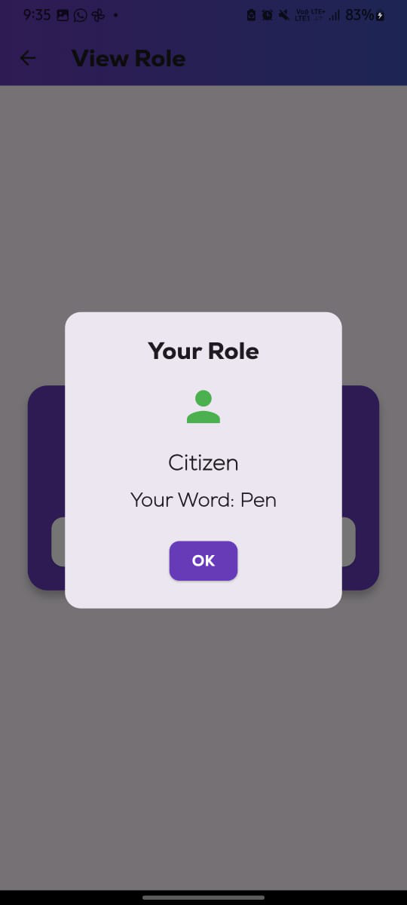
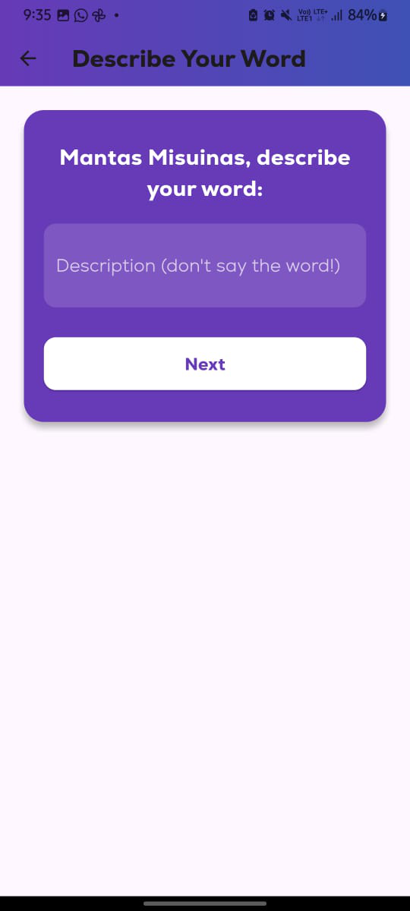
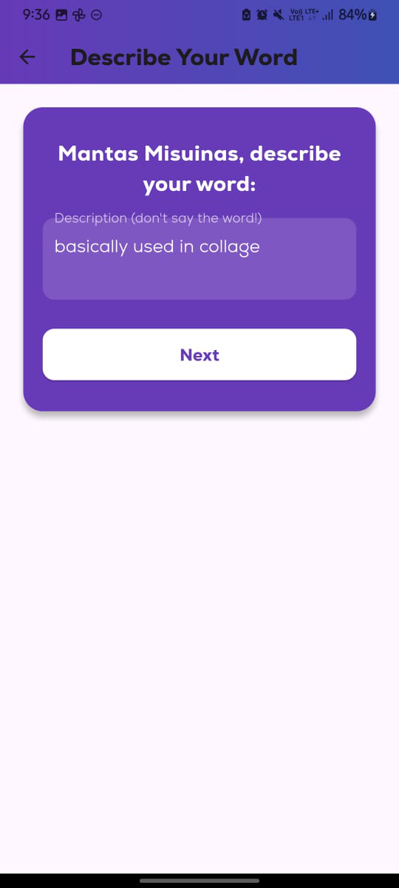
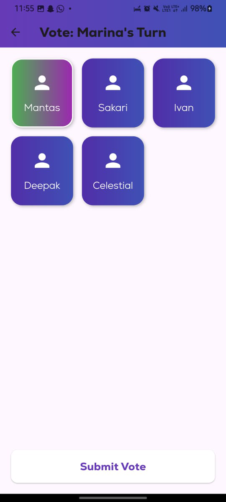
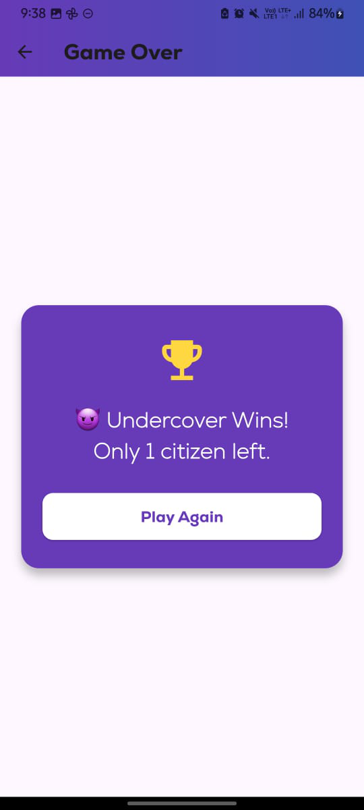
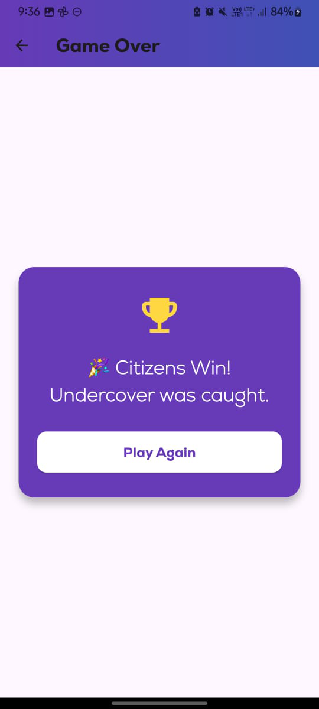

# 🎭 Undercover_game_clone

A simple multiplayer party game built in Flutter — inspired by the popular social deduction game Undercover. Players are secretly assigned words and roles (Citizen or Undercover) and must describe their word and vote to eliminate the impostor!

### 📱 Screenshots

### 🧑 Player Setup

### 🕵️ Role Assignment

### 📜 Description

### 🗳️ Voting Round

### 🎉 Result

### 🚀 How to Run the App
Clone the Repository

git clone https://github.com/Deeppokhriyal/undercover_game_clone.git

Install Dependencies

flutter pub get

Run the App

flutter run

Make sure you have a connected device or emulator running.

### 📂 App Structure Overview

lib/
├── main.dart                  # Entry point
├── models/
│   └── player.dart            # Player model with role, word, elimination status
├── utils/
│   └── word_pairs.dart        # Predefined pairs of similar words (Cat–Tiger etc.)
├── screens/
│   ├── setup_screen.dart      # Player count and name input
│   ├── role_screen.dart       # Role and word assignment screen
│   ├── description_screen.dart# Word description round
│   ├── voting_screen.dart     # Voting screen (handles tie + elimination logic)
│   └── result_screen.dart     # Win result display screen

### ✅ Game Flow
Enter number of players (3–12) and their names.

Roles are randomly assigned: 1 Undercover, rest Citizens.

Each player views their role + secret word.

Each round:

Players describe their word.

Everyone votes.

Most voted player is eliminated.

Tie = no one is eliminated.

### Game ends when:

🎉 Citizens win by eliminating the Undercover.
😈 Undercover wins if only 2 players are left.

### 💡 Future Improvements
Add animations and audio

Online multiplayer support

Timer for rounds and voting

Better UI design and player avatars

### 📜 License
This project is open source and available under the MIT License.

